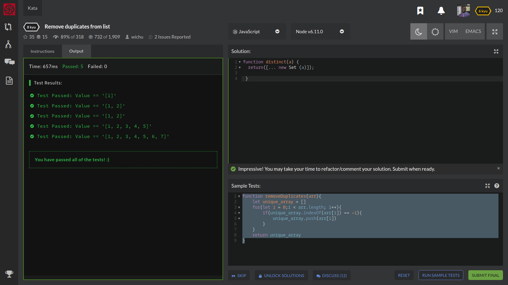

# Kata's For Breakfast, Lunch, and Dinner!
Complete the function that removes duplicates from a list of numbers.

The order of the sequence needs to stay the same.
#  FUNDAMENTALS Array

## Lessons Learned
I learned how to use new Set and the spread operator! Which is going to be a game changer! It made solving this problem that much faster then I had before with a nested loop, indexOf, and push methods.

The Set object lets you store unique values of any type, whether primitive values or object references.

So creating  return [...new Set(a)]; it allowed me to return no duplicates.

## portfolio:

**WEBSITE:** https:/johnfleurimond.com

## “Happy Codewars! And may the odds be ever in your favor.”
